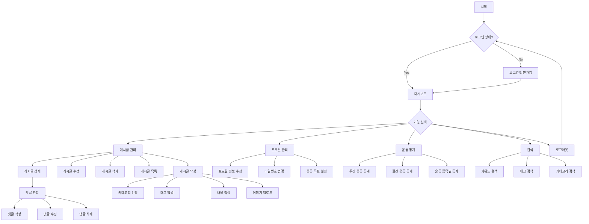
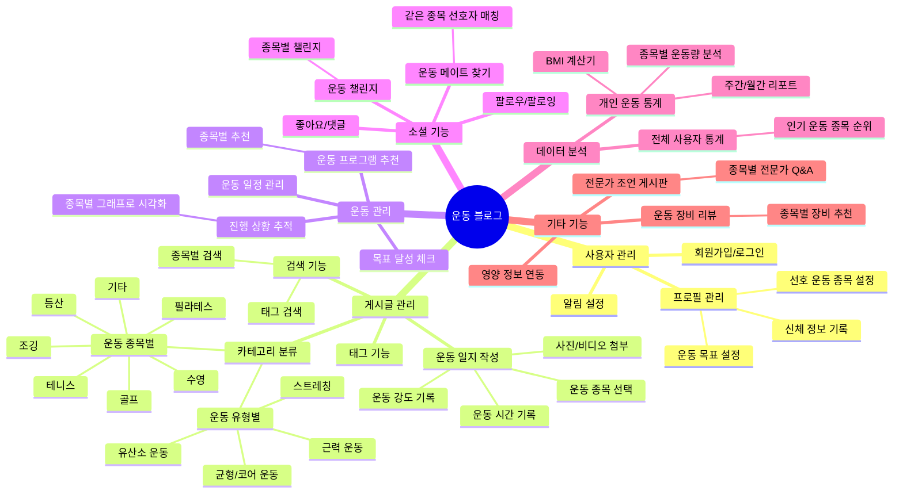
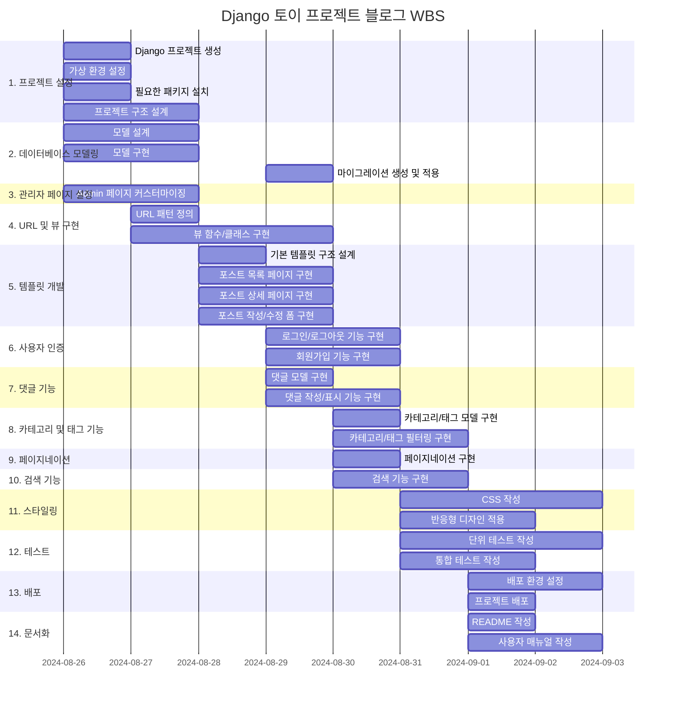
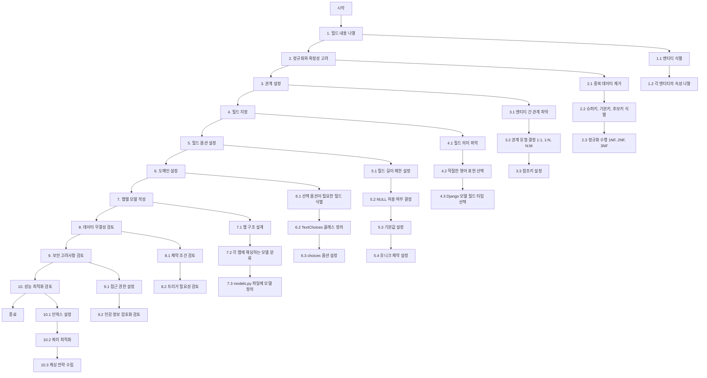

'# django_blog_AI' 

## 요구사항 명세

## 기능 명세

```mermaid
flowchart TD
    A[시작] --> B{로그인 상태?}
    B -->|Yes| C[대시보드]
    B -->|No| D[로그인/회원가입]
    D --> C
    C --> E{기능 선택}
    E --> F[게시글 관리]
    E --> G[프로필 관리]
    E --> H[운동 통계]
    E --> I[검색]
    
    F --> F1[게시글 작성]
    F --> F2[게시글 수정]
    F --> F3[게시글 삭제]
    F --> F4[게시글 목록]
    F --> F5[게시글 상세]
    
    F5 --> J[댓글 관리]
    J --> J1[댓글 작성]
    J --> J2[댓글 수정]
    J --> J3[댓글 삭제]
    
    G --> G1[프로필 정보 수정]
    G --> G2[비밀번호 변경]
    G --> G3[운동 목표 설정]
    
    H --> H1[주간 운동 통계]
    H --> H2[월간 운동 통계]
    H --> H3[운동 종목별 통계]
    
    I --> I1[키워드 검색]
    I --> I2[태그 검색]
    I --> I3[카테고리 검색]
    
    F1 --> K[카테고리 선택]
    F1 --> L[태그 입력]
    F1 --> M[내용 작성]
    F1 --> N[이미지 업로드]
    
    E --> O[로그아웃]
    O --> B
```

## 아이디어 기획

```mermaid
mindmap
  root((운동 블로그))
    사용자 관리
      회원가입/로그인
      프로필 관리
        운동 목표 설정
        신체 정보 기록
        선호 운동 종목 설정
      알림 설정
    게시글 관리
      운동 일지 작성
        운동 종목 선택
        운동 시간 기록
        운동 강도 기록
        사진/비디오 첨부
      태그 기능
      카테고리 분류
        운동 종목별
          골프
          테니스
          필라테스
          조깅
          등산
          수영
          기타
        운동 유형별
          유산소 운동
          근력 운동
          스트레칭
          균형/코어 운동
      검색 기능
        종목별 검색
        태그 검색
    운동 관리
      운동 프로그램 추천
        종목별 추천
      운동 일정 관리
      진행 상황 추적
        종목별 그래프로 시각화
      목표 달성 체크
    소셜 기능
      팔로우/팔로잉
      좋아요/댓글
      운동 메이트 찾기
        같은 종목 선호자 매칭
      운동 챌린지
        종목별 챌린지
    데이터 분석
      개인 운동 통계
        주간/월간 리포트
        종목별 운동량 분석
        BMI 계산기
      전체 사용자 통계
        인기 운동 종목 순위
    기타 기능
      영양 정보 연동
      운동 장비 리뷰
        종목별 장비 추천
      전문가 조언 게시판
        종목별 전문가 Q&A
```

## WBS 명세

```mermaid
gantt
    title Django 토이 프로젝트 블로그 WBS
    dateFormat  YYYY-MM-DD
    section 1. 프로젝트 설정
        Django 프로젝트 생성     :2024-08-26, 1d
        가상 환경 설정           :2024-08-26, 1d
        필요한 패키지 설치       :2024-08-26, 1d
        프로젝트 구조 설계       :2024-08-26, 2d
    section 2. 데이터베이스 모델링
        모델 설계               :2024-08-26, 2d
        모델 구현               :2024-08-26, 2d
        마이그레이션 생성 및 적용:2024-08-29, 1d
    section 3. 관리자 페이지 설정
        Admin 페이지 커스터마이징:2024-08-26, 2d
    section 4. URL 및 뷰 구현
        URL 패턴 정의           :2024-08-27, 1d
        뷰 함수/클래스 구현      :2024-08-27, 3d
    section 5. 템플릿 개발
        기본 템플릿 구조 설계    :2024-08-28, 1d
        포스트 목록 페이지 구현  :2024-08-28, 2d
        포스트 상세 페이지 구현  :2024-08-28, 2d
        포스트 작성/수정 폼 구현 :2024-08-28, 2d
    section 6. 사용자 인증
        로그인/로그아웃 기능 구현 :2024-08-29, 2d
        회원가입 기능 구현       :2024-08-29, 2d
    section 7. 댓글 기능
        댓글 모델 구현          :2024-08-29, 1d
        댓글 작성/표시 기능 구현 :2024-08-29, 2d
    section 8. 카테고리 및 태그 기능
        카테고리/태그 모델 구현  :2024-08-30, 1d
        카테고리/태그 필터링 구현:2024-08-30, 2d
    section 9. 페이지네이션
        페이지네이션 구현       :2024-08-30, 1d
    section 10. 검색 기능
        검색 기능 구현          :2024-08-30, 2d
    section 11. 스타일링
        CSS 작성               :2024-08-31, 3d
        반응형 디자인 적용      :2024-08-31, 2d
    section 12. 테스트
        단위 테스트 작성        :2024-08-31, 3d
        통합 테스트 작성        :2024-08-31, 2d
    section 13. 배포
        배포 환경 설정          :2024-09-01, 2d
        프로젝트 배포           :2024-09-01, 1d
    section 14. 문서화
        README 작성            :2024-09-01, 1d
        사용자 매뉴얼 작성      :2024-09-01, 2d
```

## 와이어프레임

## ERD: 데이터베이스 구조 설계

### 단계별 구상 

```mermaid
flowchart TD
    A[시작] --> B[1. 필드 내용 나열]
    B --> C[2. 정규화와 확장성 고려]
    C --> D[3. 관계 설정]
    D --> E[4. 필드 지정]
    E --> F[5. 필드 옵션 설정]
    F --> G[6. 도메인 설정]
    G --> H[7. 앱별 모델 작성]
    H --> I[8. 데이터 무결성 검토]
    I --> J[9. 보안 고려사항 검토]
    J --> K[10. 성능 최적화 검토]
    K --> L[종료]

    B1[1.1 엔티티 식별]
    B2[1.2 각 엔티티의 속성 나열]
    B --> B1 --> B2

    C1[2.1 중복 데이터 제거]
    C2[2.2 슈퍼키, 기본키, 후보키 식별]
    C3[2.3 정규화 수행 1NF, 2NF, 3NF]
    C --> C1 --> C2 --> C3

    D1[3.1 엔티티 간 관계 파악]
    D2[3.2 관계 유형 결정 1:1, 1:N, N:M]
    D3[3.3 참조키 설정]
    D --> D1 --> D2 --> D3

    E1[4.1 필드 의미 파악]
    E2[4.2 적절한 영어 표현 선택]
    E3[4.3 Django 모델 필드 타입 선택]
    E --> E1 --> E2 --> E3

    F1[5.1 필드 길이 제한 설정]
    F2[5.2 NULL 허용 여부 결정]
    F3[5.3 기본값 설정]
    F4[5.4 유니크 제약 설정]
    F --> F1 --> F2 --> F3 --> F4

    G1[6.1 선택 옵션이 필요한 필드 식별]
    G2[6.2 TextChoices 클래스 정의]
    G3[6.3 choices 옵션 설정]
    G --> G1 --> G2 --> G3

    H1[7.1 앱 구조 설계]
    H2[7.2 각 앱에 해당하는 모델 분류]
    H3[7.3 models.py 파일에 모델 정의]
    H --> H1 --> H2 --> H3

    I1[8.1 제약 조건 검토]
    I2[8.2 트리거 필요성 검토]
    I --> I1 --> I2

    J1[9.1 접근 권한 설정]
    J2[9.2 민감 정보 암호화 검토]
    J --> J1 --> J2

    K1[10.1 인덱스 설정]
    K2[10.2 쿼리 최적화]
    K3[10.3 캐싱 전략 수립]
    K --> K1 --> K2 --> K3
```

