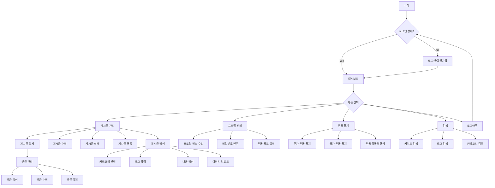
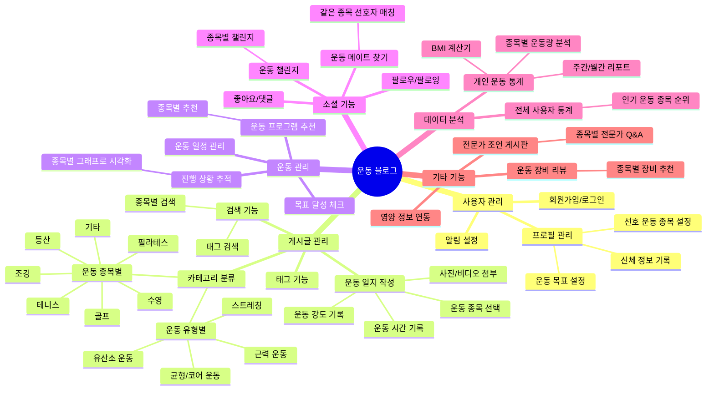
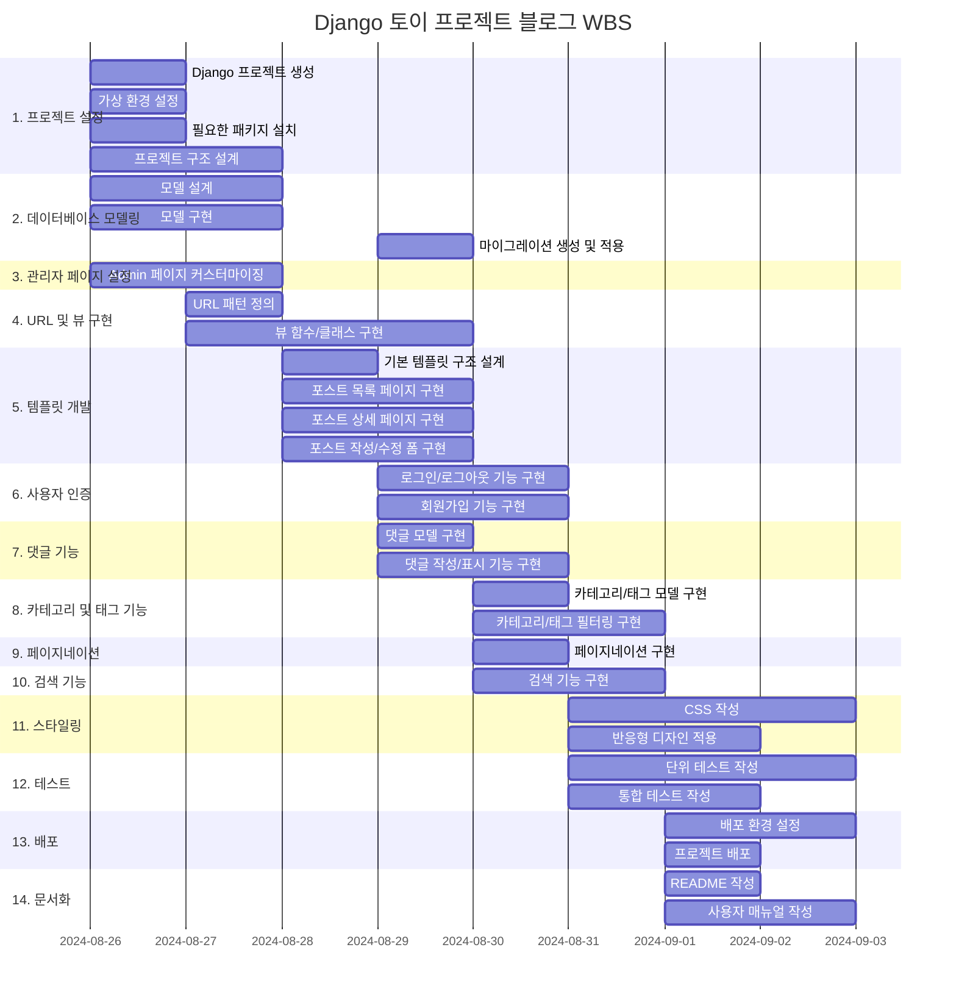
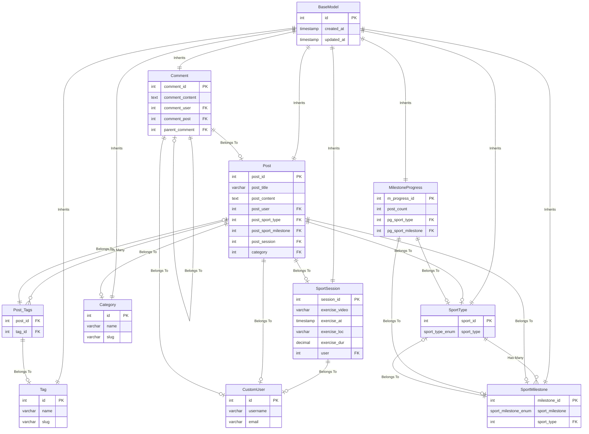

'# django_blog_AI' 

## 요구사항 명세

## 기능 명세

```mermaid
flowchart TD
    A[시작] --> B{로그인 상태?}
    B -->|Yes| C[대시보드]
    B -->|No| D[로그인/회원가입]
    D --> C
    C --> E{기능 선택}
    E --> F[게시글 관리]
    E --> G[프로필 관리]
    E --> H[운동 통계]
    E --> I[검색]
    
    F --> F1[게시글 작성]
    F --> F2[게시글 수정]
    F --> F3[게시글 삭제]
    F --> F4[게시글 목록]
    F --> F5[게시글 상세]
    
    F5 --> J[댓글 관리]
    J --> J1[댓글 작성]
    J --> J2[댓글 수정]
    J --> J3[댓글 삭제]
    
    G --> G1[프로필 정보 수정]
    G --> G2[비밀번호 변경]
    G --> G3[운동 목표 설정]
    
    H --> H1[주간 운동 통계]
    H --> H2[월간 운동 통계]
    H --> H3[운동 종목별 통계]
    
    I --> I1[키워드 검색]
    I --> I2[태그 검색]
    I --> I3[카테고리 검색]
    
    F1 --> K[카테고리 선택]
    F1 --> L[태그 입력]
    F1 --> M[내용 작성]
    F1 --> N[이미지 업로드]
    
    E --> O[로그아웃]
    O --> B
```

## 아이디어 기획

```mermaid
mindmap
  root((운동 블로그))
    사용자 관리
      회원가입/로그인
      프로필 관리
        운동 목표 설정
        신체 정보 기록
        선호 운동 종목 설정
      알림 설정
    게시글 관리
      운동 일지 작성
        운동 종목 선택
        운동 시간 기록
        운동 강도 기록
        사진/비디오 첨부
      태그 기능
      카테고리 분류
        운동 종목별
          골프
          테니스
          필라테스
          조깅
          등산
          수영
          기타
        운동 유형별
          유산소 운동
          근력 운동
          스트레칭
          균형/코어 운동
      검색 기능
        종목별 검색
        태그 검색
    운동 관리
      운동 프로그램 추천
        종목별 추천
      운동 일정 관리
      진행 상황 추적
        종목별 그래프로 시각화
      목표 달성 체크
    소셜 기능
      팔로우/팔로잉
      좋아요/댓글
      운동 메이트 찾기
        같은 종목 선호자 매칭
      운동 챌린지
        종목별 챌린지
    데이터 분석
      개인 운동 통계
        주간/월간 리포트
        종목별 운동량 분석
        BMI 계산기
      전체 사용자 통계
        인기 운동 종목 순위
    기타 기능
      영양 정보 연동
      운동 장비 리뷰
        종목별 장비 추천
      전문가 조언 게시판
        종목별 전문가 Q&A
```

## WBS 명세

```mermaid
gantt
    title Django 토이 프로젝트 블로그 WBS
    dateFormat  YYYY-MM-DD
    section 1. 프로젝트 설정
        Django 프로젝트 생성     :2024-08-26, 1d
        가상 환경 설정           :2024-08-26, 1d
        필요한 패키지 설치       :2024-08-26, 1d
        프로젝트 구조 설계       :2024-08-26, 2d
    section 2. 데이터베이스 모델링
        모델 설계               :2024-08-26, 2d
        모델 구현               :2024-08-26, 2d
        마이그레이션 생성 및 적용:2024-08-29, 1d
    section 3. 관리자 페이지 설정
        Admin 페이지 커스터마이징:2024-08-26, 2d
    section 4. URL 및 뷰 구현
        URL 패턴 정의           :2024-08-27, 1d
        뷰 함수/클래스 구현      :2024-08-27, 3d
    section 5. 템플릿 개발
        기본 템플릿 구조 설계    :2024-08-28, 1d
        포스트 목록 페이지 구현  :2024-08-28, 2d
        포스트 상세 페이지 구현  :2024-08-28, 2d
        포스트 작성/수정 폼 구현 :2024-08-28, 2d
    section 6. 사용자 인증
        로그인/로그아웃 기능 구현 :2024-08-29, 2d
        회원가입 기능 구현       :2024-08-29, 2d
    section 7. 댓글 기능
        댓글 모델 구현          :2024-08-29, 1d
        댓글 작성/표시 기능 구현 :2024-08-29, 2d
    section 8. 카테고리 및 태그 기능
        카테고리/태그 모델 구현  :2024-08-30, 1d
        카테고리/태그 필터링 구현:2024-08-30, 2d
    section 9. 페이지네이션
        페이지네이션 구현       :2024-08-30, 1d
    section 10. 검색 기능
        검색 기능 구현          :2024-08-30, 2d
    section 11. 스타일링
        CSS 작성               :2024-08-31, 3d
        반응형 디자인 적용      :2024-08-31, 2d
    section 12. 테스트
        단위 테스트 작성        :2024-08-31, 3d
        통합 테스트 작성        :2024-08-31, 2d
    section 13. 배포
        배포 환경 설정          :2024-09-01, 2d
        프로젝트 배포           :2024-09-01, 1d
    section 14. 문서화
        README 작성            :2024-09-01, 1d
        사용자 매뉴얼 작성      :2024-09-01, 2d
```

## 와이어프레임

## ERD: 데이터베이스 구조 설계

```mermaid
erDiagram
    BaseModel {
        int id PK
        timestamp created_at
        timestamp updated_at
    }

    SportType {
        int sport_id PK
        sport_type_enum sport_type
    }

    SportMilestone {
        int milestone_id PK
        sport_milestone_enum sport_milestone
        int sport_type FK
    }

    SportSession {
        int session_id PK
        varchar exercise_video
        timestamp exercise_at
        varchar exercise_loc
        decimal exercise_dur
        int user FK
    }

    Category {
        int id PK
        varchar name
        varchar slug
    }

    Tag {
        int id PK
        varchar name
        varchar slug
    }

    Post {
        int post_id PK
        varchar post_title
        text post_content
        int post_user FK
        int post_sport_type FK
        int post_sport_milestone FK
        int post_session FK
        int category FK
    }

    Post_Tags {
        int post_id FK
        int tag_id FK
    }

    Comment {
        int comment_id PK
        text comment_content
        int comment_user FK
        int comment_post FK
        int parent_comment FK
    }

    MilestoneProgress {
        int m_progress_id PK
        int post_count
        int pg_sport_type FK
        int pg_sport_milestone FK
    }

    CustomUser {
        int id PK
        varchar username
        varchar email
    }

    %% Relationships
    BaseModel ||--|| SportType : "Inherits"
    BaseModel ||--|| SportMilestone : "Inherits"
    BaseModel ||--|| SportSession : "Inherits"
    BaseModel ||--|| Category : "Inherits"
    BaseModel ||--|| Tag : "Inherits"
    BaseModel ||--|| Post : "Inherits"
    BaseModel ||--|| Comment : "Inherits"
    BaseModel ||--|| MilestoneProgress : "Inherits"

    SportType ||--o{ SportMilestone : "Has Many"
    SportMilestone ||--o| SportType : "Belongs To"

    SportSession ||--o| CustomUser : "Belongs To"

    Post ||--o| CustomUser : "Belongs To"
    Post ||--o| SportType : "Belongs To"
    Post ||--o| SportMilestone : "Belongs To"
    Post ||--o| SportSession : "Belongs To"
    Post ||--o| Category : "Belongs To"
    Post ||--o{ Post_Tags : "Has Many"

    Post_Tags ||--o| Tag : "Belongs To"
    Post_Tags ||--o| Post : "Belongs To"

    Comment ||--o| CustomUser : "Belongs To"
    Comment ||--o| Post : "Belongs To"
    Comment ||--o| Comment : "Belongs To"

    MilestoneProgress ||--o| SportType : "Belongs To"
    MilestoneProgress ||--o| SportMilestone : "Belongs To"

```